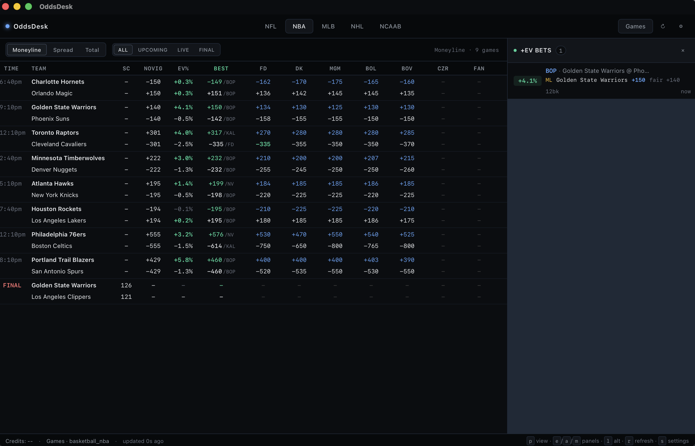
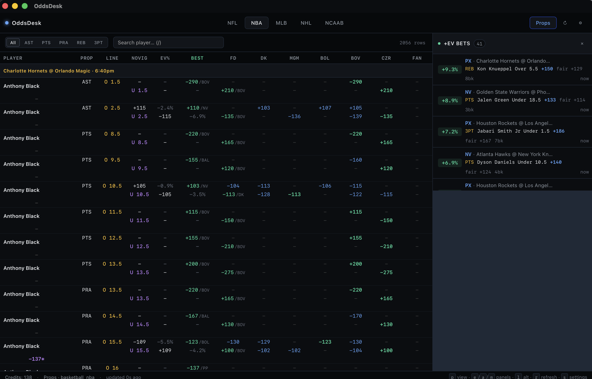
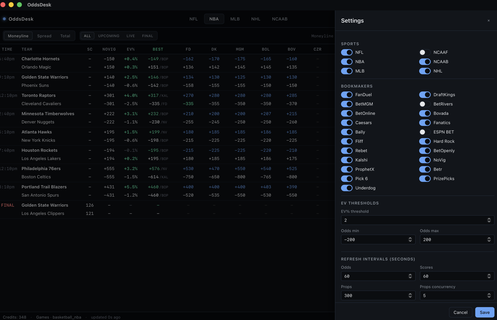
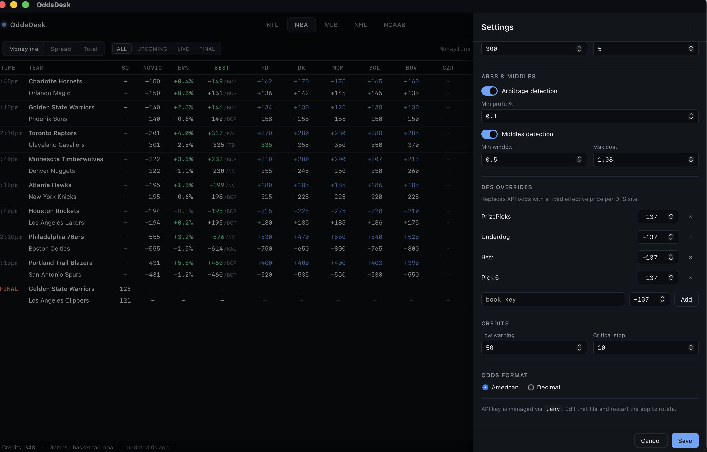

# OddsDesk

Desktop app that pulls real-time sports odds from 20+ US bookmakers and
surfaces +EV bets, arbitrage opportunities, and middles.

Built with [Tauri 2](https://v2.tauri.app/), [Svelte 5](https://svelte.dev/),
and Rust. Ported from the original Python Textual TUI (preserved under
`python-legacy/` as a reference implementation).



---

## First-time setup

OddsDesk needs an API key from [The Odds API](https://the-odds-api.com/).
The free tier gives 500 credits/month (enough to try it out); the $30/month
plan (20,000 credits) is the comfortable floor for regular use.

1. Sign up at the-odds-api.com and copy your API key.
2. Launch OddsDesk once to let it create its config directory, then edit
   the files inside:

   | OS | Config directory |
   | --- | --- |
   | macOS | `~/Library/Application Support/com.oddsdesk.app/` |
   | Windows | `%APPDATA%\com.oddsdesk.app\` |

3. Create a `.env` file in that directory with:
   ```
   ODDS_API_KEY=your_key_here
   ```
4. Edit `settings.yaml` in the same directory to choose your sports,
   bookmakers, refresh intervals, EV threshold, etc. (You can also edit
   most of these live from the in-app **Settings** drawer — press `s`.)
5. Restart the app. You should see live odds populate.

---

## Features

- **Live odds from 20+ US bookmakers** — FanDuel, DraftKings, BetMGM,
  BetRivers, Caesars, Fanatics, ESPN BET, and more.
- **Three markets** per game — moneyline, spreads, totals — with a toggle.
- **Alternate lines** — expand alternate spreads/totals for coverage across the
  full line ladder (`l` key).
- **Player props** across NBA / NFL / MLB / NHL with sport-specific markets
  (PTS / REB / AST / PaYd / HR / SOG etc.).
- **DFS books** — PrizePicks, Underdog, Pick6, Betr supported with
  configurable effective odds (for multi-leg pricing).
- **Inline no-vig + EV%** right in the table — fair price and the expected
  value of the best available line on every row.
- **Best-price highlighting** — the highest quote across all books is marked
  per outcome.
- **+EV detection** — market-average no-vig consensus with a configurable
  threshold. Persisted to SQLite with a "N minutes ago" age column.
- **Arbitrage detection** — two-leg guaranteed-profit opportunities with
  recommended stake sizing (Leg A fixed at $100, Leg B equalized) and payout.
- **Middles detection** — cross-line opportunities with hit probability,
  window size, and hit/miss profit calculation.
- **Live scores** — game status, live scores, and start times from The Odds API
  scores endpoint.
- **API credit management** — tracks remaining credits from response headers,
  warns at configurable thresholds, pauses fetching when critical.
- **Configurable** — in-app settings drawer persists to `settings.yaml`.

### Player props



### Settings

Press `s` to open the Settings drawer. Every key from `settings.yaml` is
editable live (except the API key, which is managed via `.env`).




---

## Keyboard shortcuts

| Key | Action |
| --- | --- |
| `p` | Toggle between games and player props |
| `e` | Toggle +EV panel |
| `a` | Toggle arbitrage panel |
| `m` | Toggle middles panel |
| `s` | Toggle settings drawer |
| `l` | Toggle alternate lines |
| `r` | Force refresh current sport |
| `←` / `→` | Previous / next sport |
| `1` / `2` / `3` | Games: moneyline / spread / total |
| `f` | Games: cycle game filter (ALL → UPCOMING → LIVE → FINAL) |
| `t` | Props: cycle market filter |
| `/` | Props: focus search |

---

## Build from source

Prereqs: Node 22+, pnpm 10+, Rust stable.

```bash
git clone https://github.com/<your-org>/oddsdesk.git
cd oddsdesk
pnpm install
pnpm tauri dev          # hot-reloading dev build
pnpm tauri build        # release build → src-tauri/target/release/bundle/
```

In dev mode the app reads `settings.yaml` and `.env` from the repo root
instead of the per-user config directory.

---

## Configuration

All settings live in `settings.yaml`. Most fields are editable from the
in-app Settings drawer; the full list with defaults:

| Setting | Default | Description |
| --- | --- | --- |
| `sports` | NFL, NBA, MLB, NHL, NCAAB | Which sports to show as tabs |
| `bookmakers` | 20+ US books | Books to compare odds across |
| `regions_games` | us, us2, us_ex | Regions for game-line `/odds` + alt-lines |
| `regions_props` | us, us2, us_dfs | Regions for player-prop `/events/{id}/odds` |
| `odds_refresh_interval` | 120 | Seconds between odds refreshes |
| `scores_refresh_interval` | 60 | Seconds between scores refreshes |
| `props_refresh_interval` | 300 | Seconds between props refreshes |
| `props_max_concurrent` | 5 | Max parallel event fetches for props |
| `ev_threshold` | 2.0 | Minimum EV% to flag a bet |
| `ev_odds_min` / `ev_odds_max` | -200 / 200 | Restrict EV flagging to a price range |
| `odds_format` | american | `american` or `decimal` |
| `arb_enabled` | true | Run arb detection |
| `arb_min_profit_pct` | 0.1 | Minimum profit % to surface an arb |
| `middle_enabled` | true | Run middles detection |
| `middle_min_window` | 0.5 | Minimum point window for a middle |
| `middle_max_combined_cost` | 1.08 | Max combined implied prob for middles |
| `dfs_books` | {} | DFS book → effective odds overrides |
| `props_markets` | per-sport | Which prop markets to fetch per sport |
| `low_credit_warning` | 50 | Show warning at this credit balance |
| `critical_credit_stop` | 10 | Pause API calls at this balance |

---

## How detection works

**+EV**: for each outcome, the engine averages the implied probabilities
across every book offering it, normalizes to remove the vig (so the pair
sums to 1), and compares each book's actual price to that fair probability.
If the best price at a book yields EV ≥ `ev_threshold`, it's flagged.

**Arbitrage**: at the same line, if the best prices on opposite outcomes
across different books have implied probabilities summing to less than 1,
there's a guaranteed-profit arb. Stake sizing equalizes payout across both legs.

**Middles**: cross-line opportunities where Book A offers Over 220.5 and
Book B offers Under 222.5, creating a window (221 or 222 totals land both legs).
Hit probability is estimated from sport-specific point density.

---

## Project status

First desktop release is `v0.1.0` — functional, unsigned, personal-use.
A follow-up pass (Phase 3b in `tasks/todo.md`) will fix five known engine bugs
identified during the Rust port:

- Alt-line over-normalization in no-vig consensus
- Middles sizing inconsistency between engine EV and panel display
- `min_books` filter applying across all outcomes instead of per-outcome
- Spread-middle same-team edge case
- `american_to_decimal(0)` silent fallback

These are preserved for parity with the Python reference in v0.1.0.

---

## License

MIT. See [LICENSE](LICENSE).
